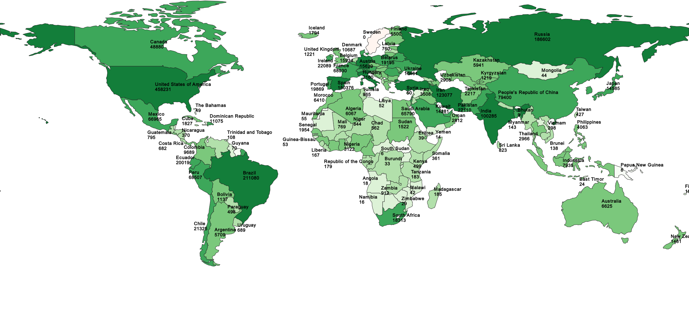
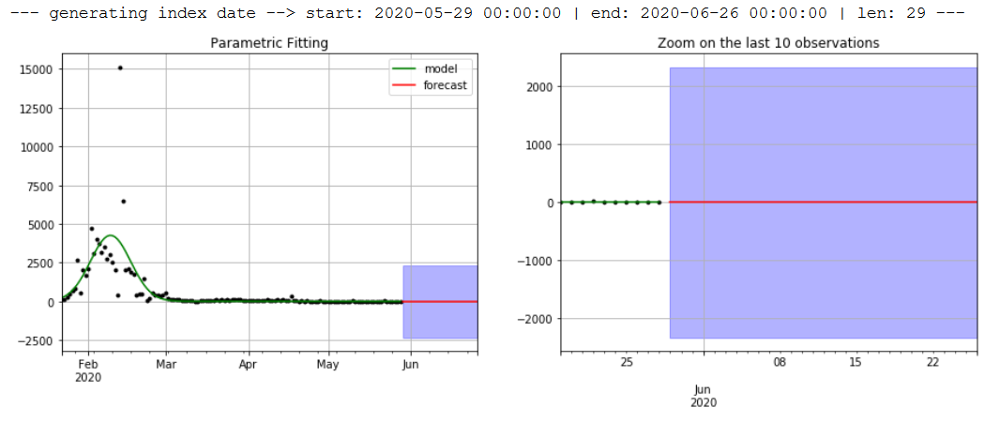
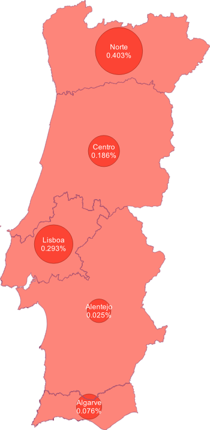

# Epidemiologia Covid-19
 
 Este trabalho foi realizado no âmbito da cadeira de SIG (Sistemas de Informação Geográfica), tendo como objetivo a análise epidemiologica do Covid-19.

Este Github está dividido em várias partes, sendo estas:
* Análise global com  gráficos e análise estatística, bem como uma análise de mapas (quer por País, quer por Continente);

* Previsão da Pandemia na China, uma análise previsiva do número de casos da pandemia no País;

* Resolução do exercício proposto no [GitHub Jgrocha](https://github.com/jgrocha/covid-pt/tree/master/Jupyter).

## [Estatística_Mundial.ipynb](https://github.com/miguelpinto-98/Epidemiologia/blob/master/Estatística_Mundial.ipynb) 
* Para este Jupyter foram utilizados dados disponibilizados quer pelo [DataHub](https://datahub.io/core/covid-19) quer também pelo
[COVID-19 Data Repository by the Center for Systems Science and Engineering (CSSE) at Johns Hopkins University](https://github.com/CSSEGISandData/COVID-19)

* Gráficos com estatísticas mundiais com a evolução da pandemia, exemplificando :

## [Dados_Por_País.ipynb](https://github.com/miguelpinto-98/Epidemiologia/blob/master/Dados_Por_País.ipynb) 

* Para este Jupyter foram utilizados dados disponibilizados quer pelo [COVID-19 Data Repository by the Center for Systems Science and Engineering (CSSE) at Johns Hopkins University](https://github.com/CSSEGISandData/COVID-19) quer também pelo
[Natural Earth](https://www.naturalearthdata.com/)

* Vários mapas criados a partir do PyQgis com a evolução da pandemia por País a nível mundial,  sendo os mais relevantes:

### Recuperados por País

### Confirmados por País

## [Dados_Por_Continente.ipynb](https://github.com/miguelpinto-98/Epidemiologia/blob/master/Dados_Por_Continente.ipynb) 

* Para este Jupyter foram utilizados dados disponibilizados quer pelo [European Centre for Disease Prevention and Control](https://www.ecdc.europa.eu/en/publications-data/download-todays-data-geographic-distribution-covid-19-cases-worldwide) quer também pelo
[Arcgis](https://www.arcgis.com/home/item.html?id=5cf4f223c4a642eb9aa7ae1216a04372)

* Vários mapas criados a partir do PyQgis com a evolução da pandemia por continente, sendo os mais relevantes:

### Confirmados por Continente

### Mortes por Continente

## [Previsão da Pandemia na China](https://github.com/miguelpinto-98/Epidemiologia/blob/master/Previs%C3%A3o%20Pandemia%20na%20China/Previs%C3%A3o.ipynb) 

* Para este Jupyter foram utilizados dados disponibilizados pelo [COVID-19 Data Repository by the Center for Systems Science and Engineering (CSSE) at Johns Hopkins University](https://github.com/CSSEGISandData/COVID-19), construído com base no repositório do [mdipietro09](https://github.com/mdipietro09/DataScience_ArtificialIntelligence_Utils/blob/master/time_series/example_parametric_fit.ipynb)

* Foi feita uma previsão para o número total de casos na China, com base numa função logística, para os 40 dias seguintes:

* Também foi feita uma previsão para o número diário de novos casos na China, com base numa função gaussiana, para os 40 dias seguintes:

## [Ponto da Situação em Percentagem](https://github.com/miguelpinto-98/Epidemiologia/blob/master/Ponto%20da%20Situa%C3%A7%C3%A3o%20em%20Percentagem.ipynb)

* Os dados utilizados neste Jupyter encontram-se referidos no Github do respetivo [exercício](https://github.com/jgrocha/covid-pt/blob/master/Jupyter/Ponto%20da%20Situa%C3%A7%C3%A3o%20em%20Percentagem.ipynb)

* Assim sendo é possível responder à questão: "O Norte aparece com muitos mais casos do que as outras regiões. Será que assim é?", podendo-se dizer que sim, o Norte é a região mais afetada.

## Autor
* **Miguel Pinto**  - [miguelpinto-98](https://github.com/miguelpinto-98)

Ver também a lista de  [contributors](https://github.com/miguelpinto-98/Epidemiologia/contributors) que participaram no projeto.
