# *Projeto Final da aluna Cláudia Alves (A80790) para a UC de Sistemas de Informação Geográfica*

Visualização de casos de COVID-19 através de gráficos e mapas

Neste notebook estão alguns gráficos relativos aos casos de COVID-19 em alguns países

##### Os datasets utilizados foram retirados dos seguintes repositórios do GitHub

* https://github.com/CSSEGISandData/COVID-19/tree/master/csse_covid_19_data

* https://github.com/open-covid-19/data

##### O repositório encontra-se dividido em diferentes pastas:
* **[COVID](https://github.com/Claudia-Alves/Epidemiologia/tree/master/Projeto%20Final%20-%20A80790/COVID)**: Dados usados na obtenção dos mapas;
* **[Dados](https://github.com/Claudia-Alves/Epidemiologia/tree/master/Projeto%20Final%20-%20A80790/Dados)**: Dados usados nas restantes estatísticas, incluindo os novos ficheiros criados;
* **[Figuras](https://github.com/Claudia-Alves/Epidemiologia/tree/master/Projeto%20Final%20-%20A80790/Figuras)**: Imagens dos gráficos, estatísticas e mapas;
* **[Países](https://github.com/Claudia-Alves/Epidemiologia/tree/master/Projeto%20Final%20-%20A80790/Paises)**: Utilizado para a realização dos mapas;
* O **notebook** é o ficheiro [Projeto_Final.ypnb](https://github.com/Claudia-Alves/Epidemiologia/blob/master/Projeto%20Final%20-%20A80790/Projeto_final.ipynb).

## Agrupamento dos dados por países

Obtiveram-se alguns gráficos com os casos por países, utilizou-se uma função para apenas contar os países com *mais de 100* casos.
__*NOTA*: em alguns gráficos, como os valores são muito elevados, aparece a notação científica.__

 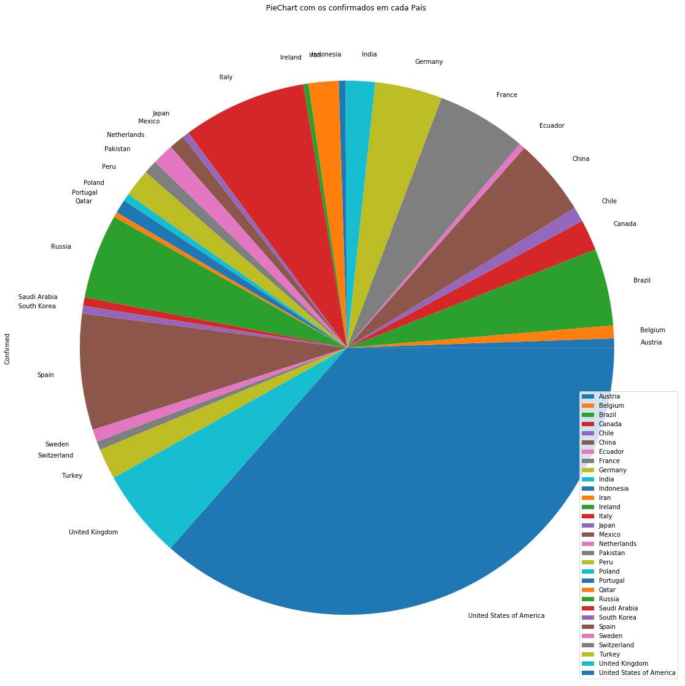 

Gráfico com os confirmados e os mortos, de acordo com os países com mais confirmados.

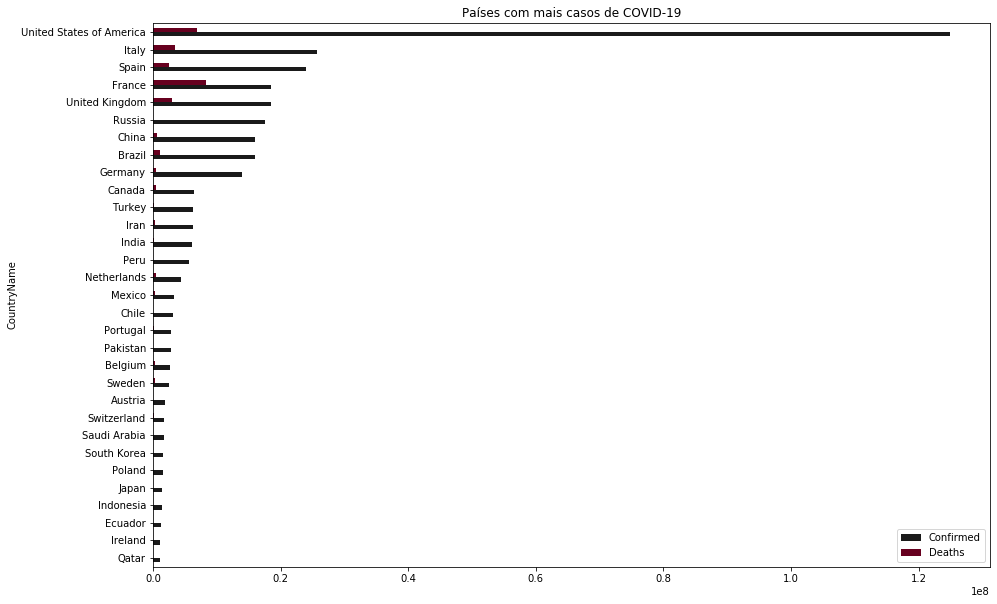

Em ambos os gráficos, é possível verificar que o país com mais casos é os Estados Unidos da América, seguido de Itália, Espanha e França.

Gráficos com o total de confirmados vs mortos, para tal fez-se a soma de todos os confirmados e mortos por país até a data.

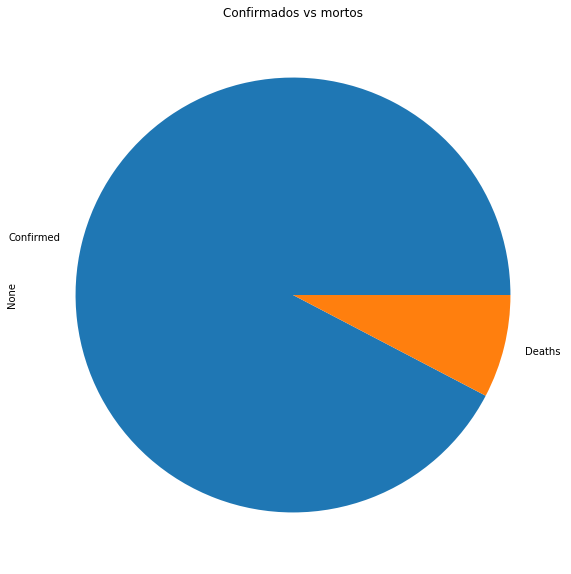

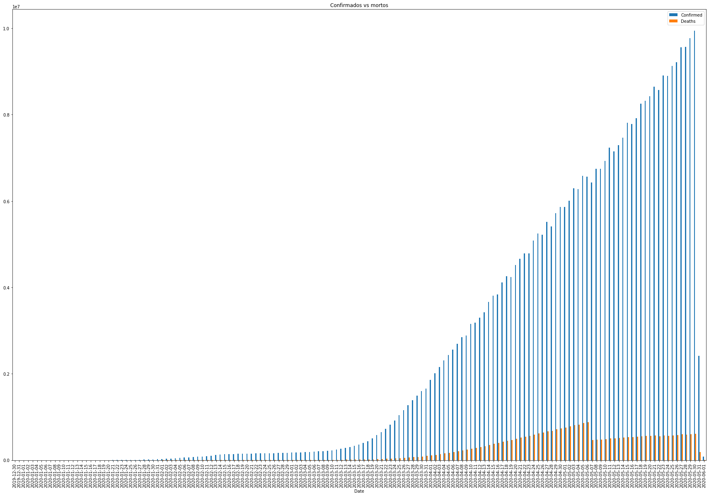

### Casos por categoria

Tendo em conta alguns dados de tempo médio até ser dada a alta a casos graves e críticos, obteve-se um gráfico com o Tempo médio de hospitalização para cada um deles. Observando a reta, dá aproximadamente um tempo médio de hospitalização 12 dias para casos graves e de 15 dias para casos hospitalizados.

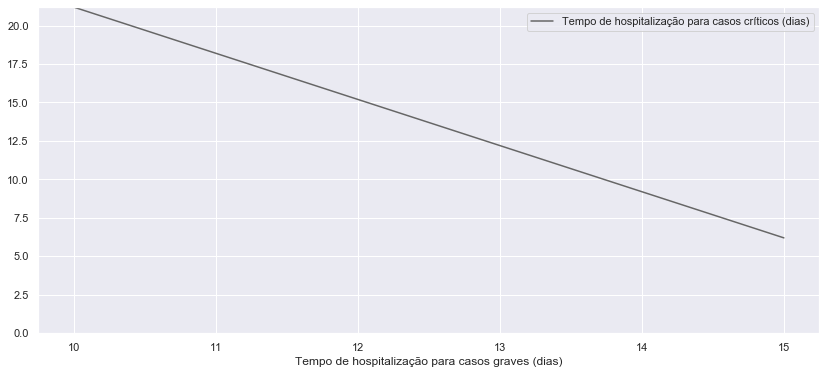 

Fez-se um gráfico relativo aos casos de COVID-19 por três categorias, leves, graves e críticos. 
Observando-o, verifica-se que, felizmente, a maioria dos casos são casos leves.

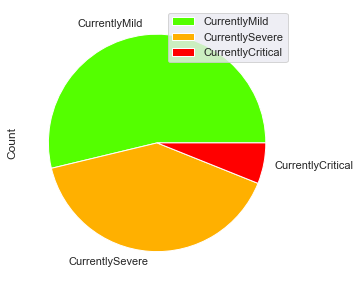

## Mapas mundo

Utilizaram-se os dados atuais de mortos e recuperados nos diferentes países para construir os mapas com a Taxa de Mortalidade no Mundo e com a Taxa de Recuperação no mundo. 

#### Taxa de Mortalidade 
   

Verifica-se que a Austrália e a Etiópia são dois dos países com menor taxa de mortalidade devido ao COVID-19.

#### Taxa de Recuperação 

De notar, que a Austrália é um dos países com maior taxa de recuperação e menor taxa de mortalidade.

## Estatísticas de países ou regiões com mais casos

Para estas estatísticas de países ou regiões com mais casos fizeram-se alterações ao dataset utilizado, incluindo selecionar algumas colunas, agregar os dados, fazer somas e guardar esses dados em novos ficheiros csv que posteriormente foram abertos e ordenados de modo a escolher o top 10. Estes ficheiros podem ser encontrados na pasta Dados.

### Top 10 países 

#### Com mais casos confirmados

 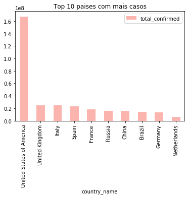 

#### Com mais mortos

 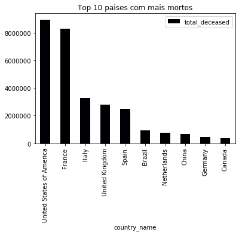 

#### Com mais recuperados

 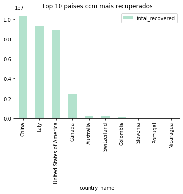 

#### Com mais casos hospitalizados

 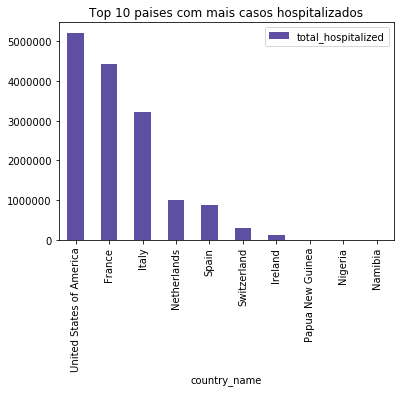 

#### Com mais casos nos cuidados intensivos

 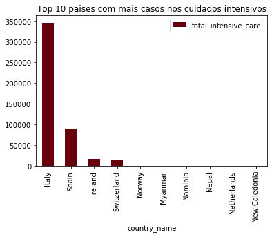 

#### Com mais testes

 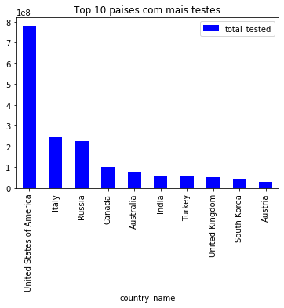 

### Top regiões na Austrália

#### Regiões com mais casos confirmados

 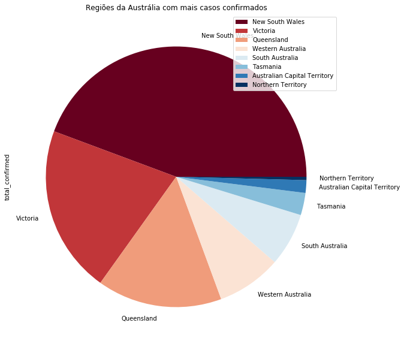 

#### Regiões com mais recuperados

 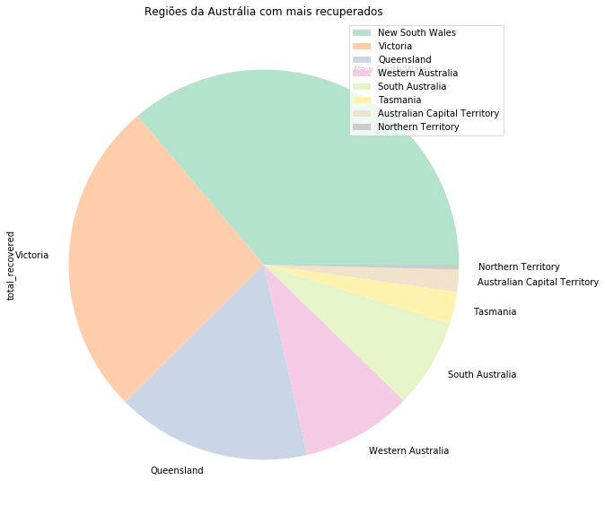 

#### Regiões com mais mortos

 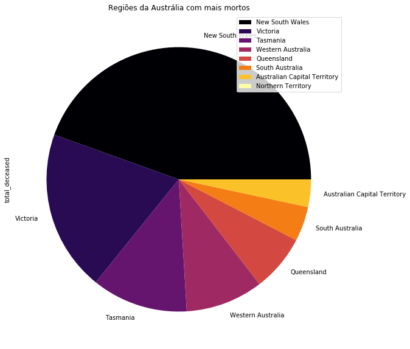 

#### Regiões com mais testes

 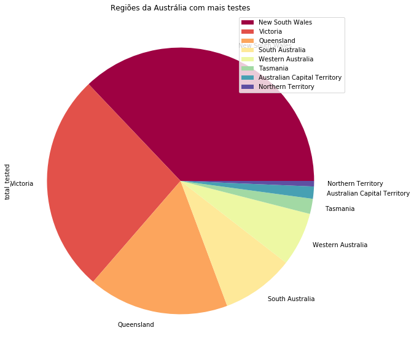 

#### Regiões com mais casos hospitalizados

 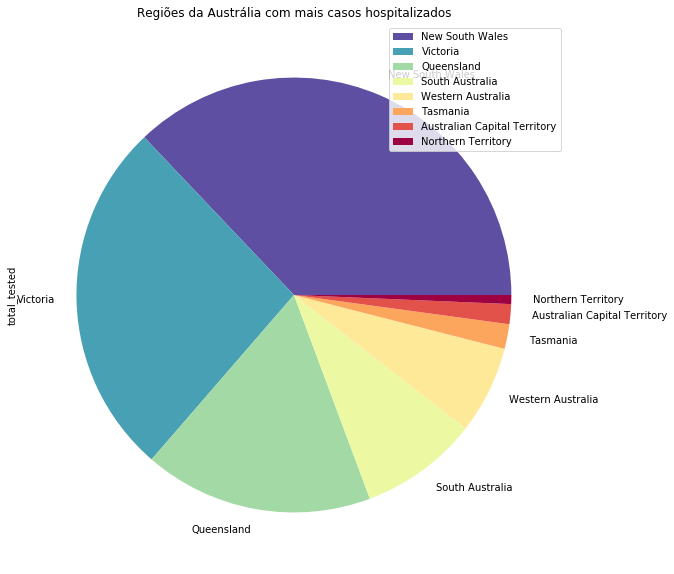 

## Casos em Espanha

Total de confirmados e mortos em Espanha por data.

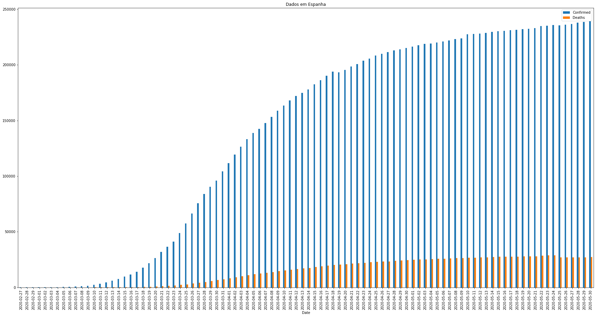

### Casos numa região de Espanha

Gráfico com os confirmados e mortos para as Asturias, uma das sub-regiões de Espanha, até a data mais atual, de notar que os dados para as sub-regiões não são tão atuais como os dados no país todo, ou seja, enquanto que para Espanha no geral se obteve os dados até ao dia 30 de Maio, para a sub-região o mais recente é 21 de maio.

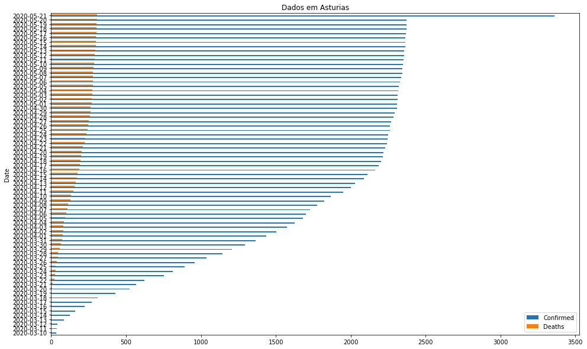

## Casos em Itália

### Total de casos Confirmados e Mortos 

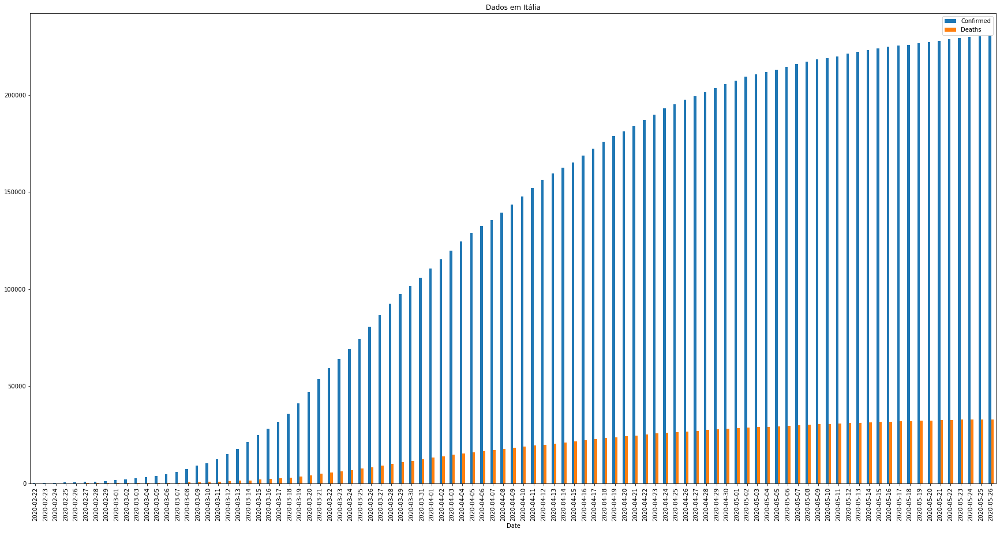

### Heurística - modelagem exponencial

Fez-se uso de uma heurística já existente e a encontrada é do dia **17 de março**, portanto,  os gráficos seguintes são baseados nessa data.

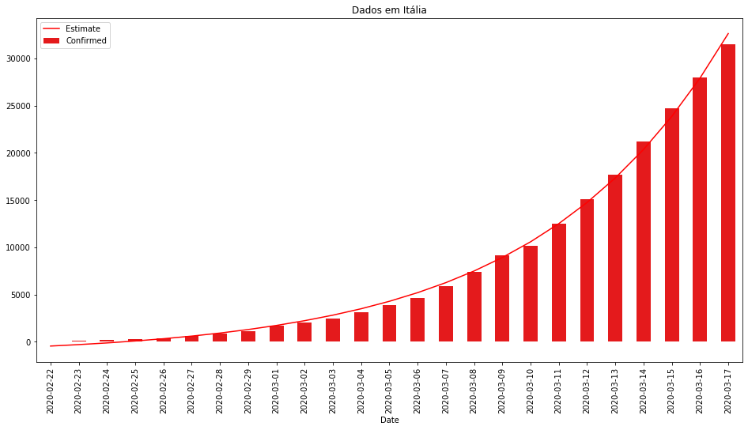

### Estimativa de 3 dias vs dados reais

### Estimar 3 dias futuros

## Casos na Corea do Sul

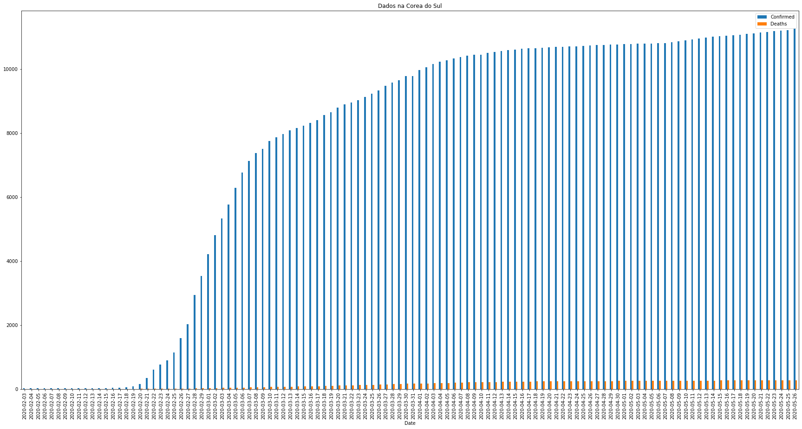

### Heurística - modelagem exponencial

Fez-se uso de uma heurística já existente e a encontrada é do dia **18 de março**, portanto,  os gráficos seguintes são baseados nessa data.

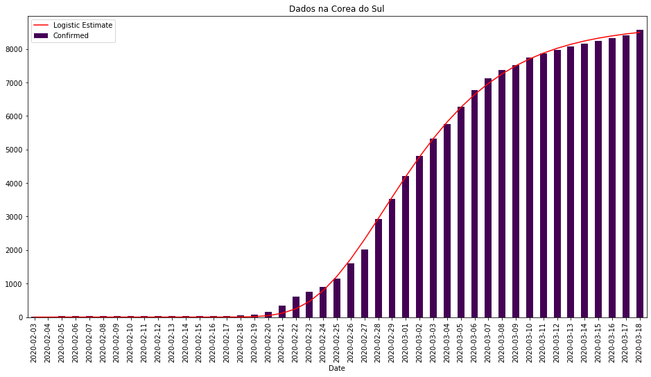

### Estimativa de 3 dias vs dados reais

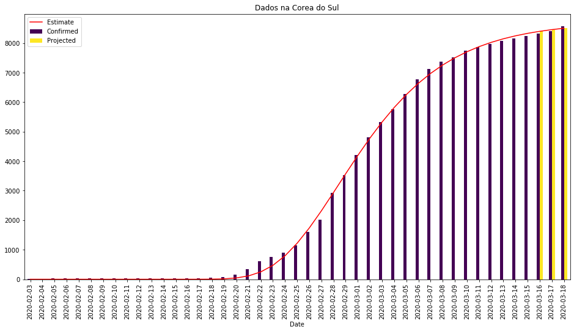

### Estimar 3 dias futuros

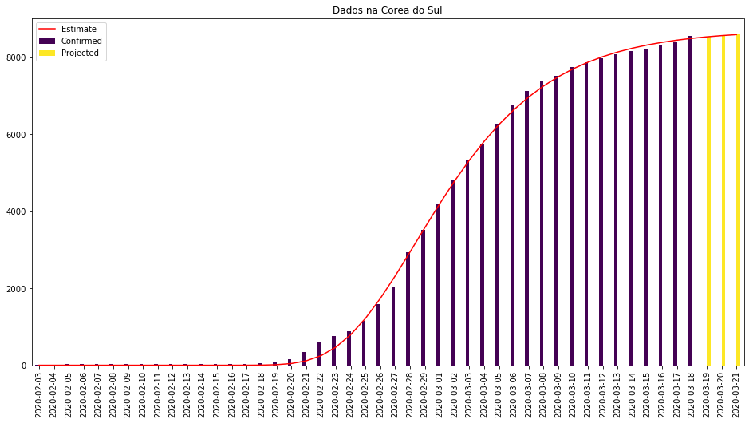

