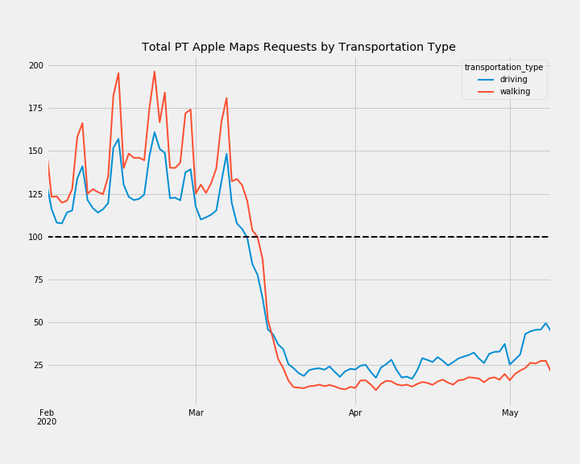
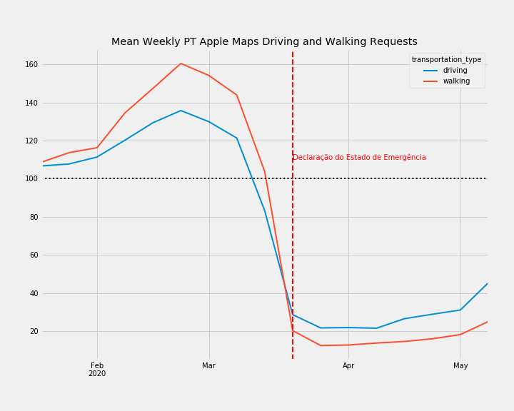
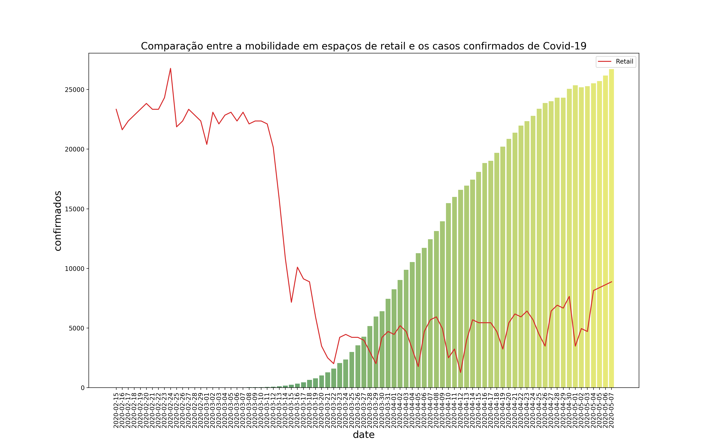
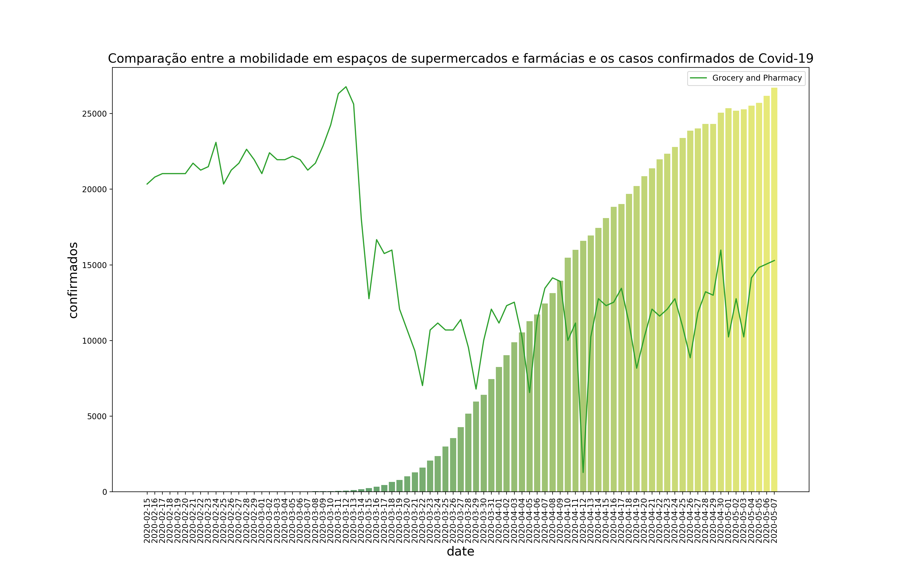
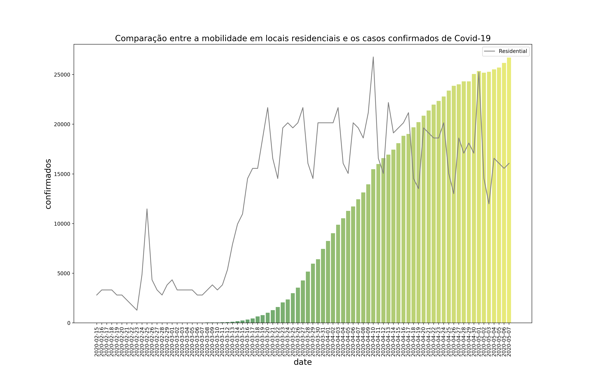
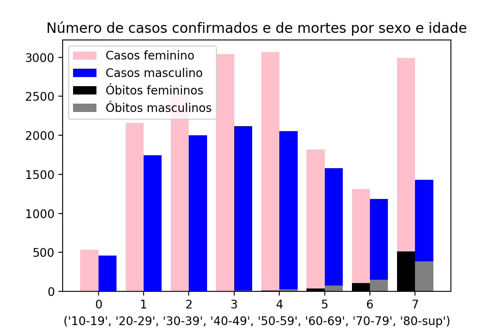
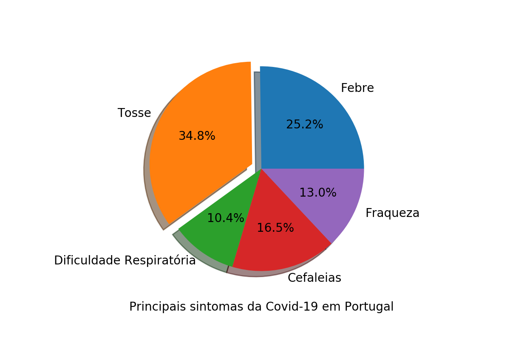
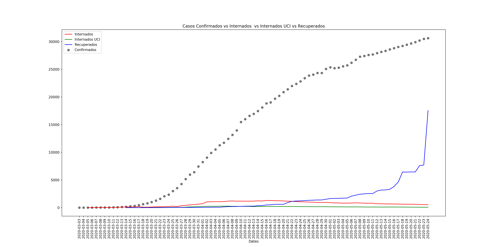
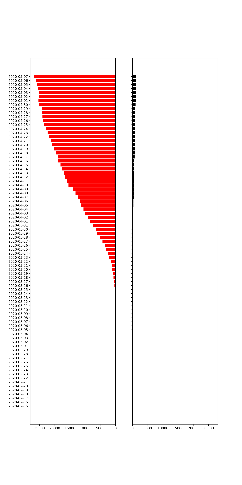

# **Dados epidemiológicos - COVID19**

## **Motivação**

Com o objetivo de estudar a propagação da Covid-19 em Portugal, desenvolveu-se um conjunto de notebooks que ajudam a entender o comportamento da população portuguesa face ao avanço da pandemia. 

## **Datasets**

### **Sobre os Relatórios de tendências de mobilidade Apple**

Os relatórios são publicados diariamente e refletem os pedidos de direções na app Mapas da Apple. A privacidade é um principais valores da empresa, pelo que a app Mapas não associa os dados ao ID Apple e a Apple não mantém um histórico das localizações visitadas.

Os dados são gerados pela contagem do número de pedidos de direções efetuados na app Mapas da Apple em determinados países/regiões, sub-regiões e cidades. Os dados que são enviados através dos dispositivos dos utilizadores para o serviço de Mapas são associados a identificadores aleatórios e rotativos, para que a Apple não tenha um perfil dos seus movimentos e das suas pesquisas. A disponibilidade dos dados num determinado país/região, sub-região ou cidade é baseada em vários fatores, incluindo limites mínimos de pedidos de direções efetuados por dia.

Os relatórios da Apple podem ser encontrados [aqui](https://github.com/rafapsm/epidemiologia/tree/master/Projeto_Covid19/apple_reports)

### **Sobre os Relatórios Google da mobilidade da comunidade**

Estes Relatórios de mobilidade da comunidade têm como objetivo fornecer estatísticas sobre o que mudou na resposta às políticas que visam combater a COVID-19. Os relatórios registam as tendências de movimento ao longo do tempo por localização geográfica, em várias categorias de locais como retalho e lazer, mercearias e farmácias, parques, estações de transportes públicos, locais de trabalho e residências.
Os relatórios podem ser encontrados [aqui](https://github.com/rafapsm/epidemiologia/tree/master/Projeto_Covid19/pdf_reports) ou no [site oficial](https://www.google.com/covid19/mobility/). 
Os dados foram extraídos dos pdfs e gerou-se [datasets](https://github.com/rafapsm/epidemiologia/tree/master/Projeto_Covid19/summary_reports) para facilitar a manipulação de dados.

#### Retail:
Tendências de mobilidade para locais como restaurantes, cafés, shoppings, parques temáticos, museus, bibliotecas e cinemas. 
#### Grocery and Pharmacy:
Tendências de mobilidade para locais como supermercados, mercados de agricultores(feiras), drogarias e farmácias.
#### Parks:
Tendências de mobilidade para locais como parques, praias públicas, marinas, jardins públicos e marginais.
#### Workplaces:
Tendências de mobilidade para locais de trabalho.
#### Residential:
Tendências de mobilidade para locais de residência.

## **Resultados**

### **Estatísticas recolhidas dos dados Apple** 

Nos gráficos abaixo é possível observar de que forma os cidadãos portugueses se deslocaram, tanto a pé como de carro, **antes e depois da declaração do estado de emergência** .

 
 
 
 
 
 
 
 
 
 
 

 
 
 
 
 

### **Mapas e estatísticas recolhidas dos dados Google** 

Na mapa abaixo é possível observar a propagação do vírus desde o dia 24/03/2020 até ao dia 08/05/2020 em Portugal Continental e por distritos. É também possível visualizar um dos gráficos que mostra a evolução da mobilidade dos portugueses em espaços de retail, grocery and pharmacy, parks, workplaces e residential. 

🗂️ [Mapa Portugal Continental Animado](https://github.com/rafapsm/epidemiologia/blob/master/Projeto_Covid19/notebooks/MapaPT_interativo.ipynb)

##### Faz o dowload deste gráfico [aqui](notebooks/mobilidade/mobilidade_pt.html)

 
 
 

Na mapa abaixo é possível observar a propagação do vírus desde o dia 24/03/2020 até ao dia 08/05/2020 nos Açores e na Madeira. É também possível visualizar um dos gráficos que mostra a evolução da mobilidade dos portugueses nas ilhas, em espaços de retail, grocery and pharmacy, parks, workplaces e residential. 

 

🗂️ [Mapa Madeira Animado](https://github.com/rafapsm/epidemiologia/blob/master/Projeto_Covid19/notebooks/MapaMadeira.ipynb)

🗂️ [Mapa Açores Animado](https://github.com/rafapsm/epidemiologia/blob/master/Projeto_Covid19/notebooks/MapaAcores.ipynb)

##### Faz o dowload deste gráfico [aqui](notebooks/mobilidade/mobilidade_ilhas.html)

#### **Avanço da COVID19 a nível global em Portugal e a mobilidade dos portugueses nos diversos espaços**

Realizou-se um estudo do comportamento dos portugueses a nível nacional, nos diversos espaços, e relacionou-se o mesmo com a evolução da Covid-19 em território nacional. Os dados mais relevantes encontram-se nas figuras seguintes, e os restantes podem ser encontrados no [notebook](notebooks/Stats.ipynb) que permitiu a realização dos gráficos.  

                                                                                                                           
 
 
 
 
                                                                                                                           
 
 
 
 

 
 
 
 

 
 
 
 

 
 
 
 

 
 

### **Mais estatísticas** 

🗂️ [Estatísticas](https://github.com/rafapsm/epidemiologia/blob/master/Projeto_Covid19/notebooks/Stats.ipynb)

O seguinte gráfico expõe o número de casos confirmados e de mortes por Covid-19, por faixa etária e por género.

O gráfico abaixo permite inferir acerca dos principais sintomas da Covid-19 em Portugal.

O gráfico seguinte compara a evolução do número de casos confirmados, internados, internados nas Unidades de Cuidados Intensivos e de recuperados em Portugal.

Por fim, o próximo gráfico compara a evolução de casos diários com o número de mortes registadas devido à Covid-19.

