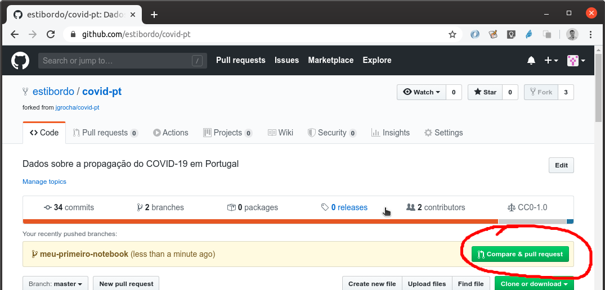

# Casos de estudo

Por favor partilhe o seu trabalho nesta pasta.

Para acrescentar o seu trabalho, siga o workflow típico do Github. Neste exemplo, usa-se um utilizador `estibordo`.

### Crie um fork através da interface

Com a sua conta, navegue até https://github.com/jgrocha/covid-pt e escolha **Fork**.


### Faça clone do seu repositório

Faça clone do seu repositório na sua máquina local, com:
```bash
git clone https://github.com/estibordo/covid-pt.git
```
Em alternativa, se usa chaves SSH, pode usar:
```bash
git clone git@github.com:estibordo/covid-pt.git
```

Ambos os comandos fazem a mesma coisa. Só o método de autenticação difere.

### Identifique adicionalmente o repositório original

Depois de fazer o clone, terá a seguinte informação sobre os seus repositórios remotos:
```bash
$ git remote -v
origin	https://github.com/estibordo/covid-pt.git (fetch)
origin	https://github.com/estibordo/covid-pt.git (push)
```
Neste caso `origin` passa a ser um __alias__ para o seu repositório remoto `https://github.com/estibordo/covid-pt.git`. Basta mencionar `origin` sempre que quiser indicar o seu repositório remoto.

Acrescente um __alias__ `upstream` para o repositório original:
```bash
git remote add upstream https://github.com/jgrocha/covid-pt.git
```
Deverá passar a ter dois alias definidos:
```bash
$ git remote -v
origin	https://github.com/estibordo/covid-pt.git (fetch)
origin	https://github.com/estibordo/covid-pt.git (push)
upstream	https://github.com/jgrocha/covid-pt.git (fetch)
upstream	https://github.com/jgrocha/covid-pt.git (push)
```

### Crie um branch para fazer as suas alterações

```bash
cd covid-pt
git checkout -b meu-primeiro-notebook
```

Faça as suas alterações. Neste exemplo, criou-se um novo notebook `Itália.ipynb` na pasta `Casos de estudo`.

### Confirme as alterações seu repositório local

```bash
git add Casos\ de\ estudo/Itália.ipynb
git commit -m "Estudo sobre o COVID-19 em Itália"
```

### Envie a sua nova contribuição para a sua cópia no GitHub

```bash
$ git push --set-upstream origin meu-primeiro-notebook
Username for 'https://github.com': estibordo
Password for 'https://estibordo@github.com': 
Enumerating objects: 4, done.
Counting objects: 100% (4/4), done.
Delta compression using up to 8 threads
Compressing objects: 100% (2/2), done.
Writing objects: 100% (3/3), 347 bytes | 347.00 KiB/s, done.
Total 3 (delta 1), reused 0 (delta 0), pack-reused 0
remote: Resolving deltas: 100% (1/1), completed with 1 local object.
remote: 
remote: Create a pull request for 'meu-primeiro-notebook' on GitHub by visiting:
remote:      https://github.com/estibordo/covid-pt/pull/new/meu-primeiro-notebook
remote: 
To https://github.com/estibordo/covid-pt.git
 * [new branch]      meu-primeiro-notebook -> meu-primeiro-notebook
Branch 'meu-primeiro-notebook' set up to track remote branch 'meu-primeiro-notebook' from 'origin'.
git push --set-upstream origin meu-primeiro-notebook
```

Neste momento, o seu repositório no Github já está diferente do repositório original. O seu repositório tem uma nova contribuição.

### Fazer o PR (Pull request)

Pelo browser, vá ao seu repositório. O Github dá-lhe imediatamente a possibilidade de fazer o Pull request, a partir do ser branch.



Preencha uma descrição sobre o que pretende adicionar ao repositório original e submeta o Pull Request.

### Aguarde que o PR seja revisto

Se lhe pedirem alterações, faça as alterações no seu repositório local, no mesmo branch. Depois de feitas as alterações, faça um novo `commit` e depois um `git push`. As suas alterações são automaticamente acrescentadas ao Pull Request em curso.

### O PR é aceite

Se se o seu PR for aceite, as suas alterações são incorporadas no repositório original e passa a constar como contribuidor do repositório.

### Se quiser voltar contribuir

Antes de mais, tem que atualizar o seu repositório local (e a sua cóia no Github) com o repositório original, para não estar a fazer as suas alterações sobre uma base antiga.

```bash
git fetch origin
git checkout master
git rebase upstream/master
```

Se tem alterações na sua cópia local, o rebase pode falhar, para não estragar as suas alterações.

Faça `git stash` para as guardar as alterações locais e poder fazer o `rebase`sem problemas. Depois aplique ou não as alterações que entretanto fez.

Depois deste `rebase`, comece a nova contribuição sobre um novo branch, tal e qual como tínhamos feito na primeira contribuição:

```bash
git checkout -b segunda-contribuicao
```