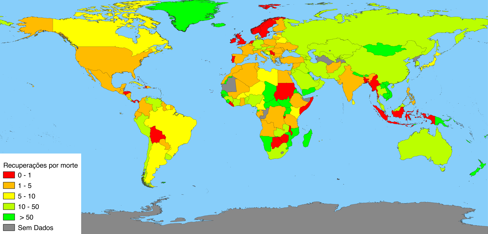

# Taxa de Recuperação e Mortalidade de COVID-19

Visualização, a nível mundial, da taxa de recuperação e mortalidade do COVID-19 em cada país tendo em conta os dados reportados e 
extraídos de: https://github.com/CSSEGISandData/COVID-19).
Esta análise consiste na produção de mapas e gráficos num Jupyter Notebook através da utilização das
ferramentas QGIS, Pandas e Matplotlib.

No notebook pode-se encontrar, com dados referentes a 15 de abril de 2020:
* um mapa apresentando a taxa de mortalidade do vírus pelo mundo;
* um mapa apresentando a taxa de recuperação do vírus pelo mundo;
* um mapa apresentando o número de recuperações contra o número de mortes causadas pelo vírus;
* um gráfico apresentando a evolução do número de casos dos 10 países com mais infetados;
* um gráfico apresentando a evolução da taxa de mortalidade dos 10 países com maior taxa de mortalidade.

## Mapa apresentando o número de recuperações contra o número de mortes causadas pelo vírus a 15 de abril de 2020

