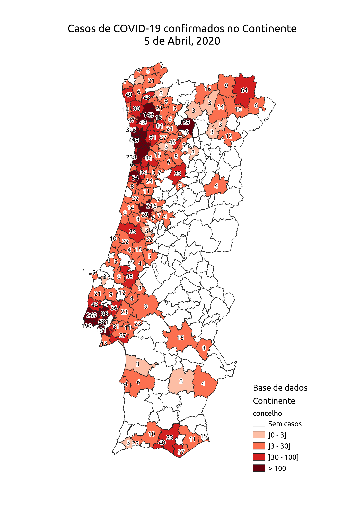

# Dados sobre COVID-19 em Portugal

Este repositório é público. Está aberto à contribuição de todos para manter e disponibilizar os dados sobre a COVID-19 em Portugal.

Os dados estão disponíveis no formato mais simples possível, para permitir o seu posterior processamento. Os dados da DGS, no formato PDF, limitam a sua reutilização para fins científicos ou de comunicação.

Para discutir os dados ou o seu processamento, por favor crie um *issue* ou um *pull request*. Para qualquer outro contacto, use o email [jgr@di.uminho.pt](mailto:jgr@di.uminho.pt).

## Participe

Se desenvolveu uma visualização, um modelo ou um algoritmo de previsão, submeta um *pull request*.

## Origem dos dados

### COVID-19 em Portugal

Os dados sobre os casos de COVID-19 são atualizados a partir do site da [DGS](https://covid19.min-saude.pt/). Os números avançados pela DGS estão publicados nos [relatórios de situação](https://covid19.min-saude.pt/relatorio-de-situacao/).

Os dados sobre a situação epidemiológica são introduzidos manualmente. Os dados por concelhos são introduzidos de forma semi-automática.

### Limites dos Concelhos 

Os dados sobre os limites dos concelhos do Continente, Região Autónoma da Madeira e Região Autónoma dos Açores provêm da Direção Geral do Território. Foram obtidos a partir da [Carta Administrativa Oficial de Portugal](http://www.dgterritorio.pt/dados_abertos/caop/).

## Sobre os dados

### Codificação

Todos os dados estão escritos com a codificação UTF-8.

### Sistemas de coordenadas

Apenas são utilizados os sistemas de coordenadas Portugueses, para o Continente, RAM e RAA.

## Dados

| Tabela                                                     | Formato                | Conteúdo                                                  |
| ---------------------------------------------------------- | ---------------------- | --------------------------------------------------------- |
| [situacao_epidemiologica.csv](situacao_epidemiologica.csv) | CSV (Folha de cálculo) | Situação epidemiológica para cada um dos dias             |
| [confirmados_concelho.csv](confirmados_concelho.csv)       | CSV (Folha de cálculo) | Número de casos para cada concelho, para cada um dos dias |
| [covid-pt-2020-04-05.gpkg](covid-pt-2020-04-05.gpkg)       | GeoPackage (QGIS)      | Além das tabelas anteriores, contém os polígonos dos concelhos |

## Mapas

Os mapas podem ser produzidos usando o software [QGIS](https://www.qgis.org/pt_PT/site/). É open source e grátis. Para questões sobre a utilização do software QGIS, inscreva-se na [lista de email do QGIS](https://lists.osgeo.org/mailman/listinfo/qgis-pt). Com o QGIS é possível, por exemplo, produzir animações com a evolução diária dos casos confirmados de COVID-19.

Para apresentar os dados no QGIS, faz-se uma relação entre as tabelas dos concelhos (que estão no Geopackage) com a tabela `confirmados_concelho` (que também está no GeoPackage). A chave de ligação é o campo `dico`.

A título de exemplo, inclui-se o mapa com os valores mais recentes por concelho.

# Origem alternativa dos dados

Os dados da DGS também estão disponível a partir do [Ponto de Situação Atual em Portugal](https://covid19.min-saude.pt/ponto-de-situacao-atual-em-portugal/). Contudo, os dados estão (também) a ser introduzidos manualmente e têm diversas gralhas. 

Sendo este um repositório aberto à participação, queremos eliminar os erros nos dados com a ajuda de todos. Se encontrar algum erro, por favor crie um *issue*.